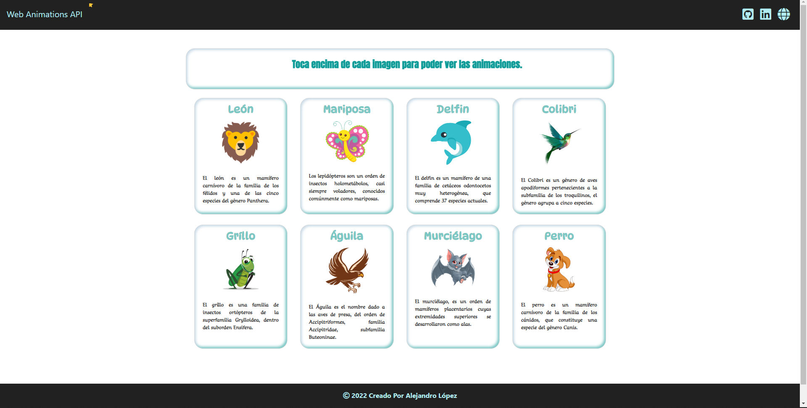

# <h1 align="center" style="color: #880e4f;"> Web Animations API 👨🏻‍💻 </h1> 
  

This web application allows you to see some animations on the images by touching them, using the `Web Animations API` that allows us to build animations and control their playback with JavaScript.   

The `Web Animations API` allows for synchronizing and timing changes to the presentation of a Web page. It does so by combining two models: the Timing Model and the Animation Model. The `Web Animations API` is a new browser API that animates elements from JavaScript as easily as from CSS Animations.
  
  

## 
 Requirements 

- [HTML5](https://developer.mozilla.org/es/docs/Web/HTML) 
- [CSS3](https://developer.mozilla.org/es/docs/Web/CSS)
- [JavaScript](https://developer.mozilla.org/es/docs/Web/JavaScript)

## 
 References 

- [Just Animate](https://just-animate.github.io/)
- [Web Animations API](https://just-animate.github.io/waapi/) 

  

## 
 Screenshot Project 💻 

🔶 [Project Website](https://alejandro-190107.github.io/Web-Animations-API/)

